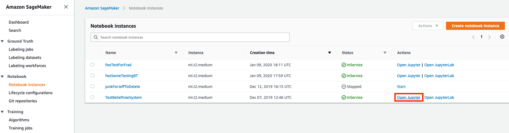
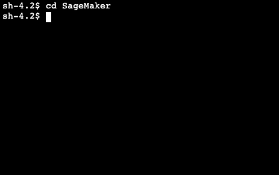

# ML_FraudDetections
Used for the TTB efforts to detect fraudulent labels and formulas

# Instructions to configure LabelValidation.ipynb locally
- When in a local laptop/desktop, just perform `pip3 install -r requirements.txt`

# From the SageMaker HomePage
- Select "Create notebook instance"
- After selecting Create notebook instance go to the Notebook instance settings page.
- Enter "Notebook instance name", and "Notebook instance type"
- From the Notebook instance settings page,
- Select "Enter a custom IAM role ARN"
- Enter an IAM role ARN
- Select "Enable - Give users root access to the notebook"
- Select "No Custom Encryption"

# From the Notebook instance settings page,
- Select "us-east-1a"
- Select "sagemakerConnectionSecurityGrp"
- Look for the "Pending" button indicating pending creation of Notebook Instance

# From the SageMaker Homepage select "Open Jupyter"
- Inside the Jupyter Notebook "Upload" LabelValidation.ipynb, FraudLabelConfig.json, and create labelImages.tar from TestData directory
- Select Upload twice to upload properly

# Untar labelImages.tar in a terminal
- Open a terminal
- Go to the terminal, cd to SageMaker, `mkdir TestData`, and in TestData `tar xvf labelImages.tar`
- Click to open LabelValidation.ipynb

# When in  Jupyter Notebook, need to use the "conda_tensorflow_p36" kernel 
- If UI asks to select Kernel upon opening notebook, enter X, and cancel
- Make certain that you do not select "conda_amazaonei_tensorflow_p36" kernel
- Make certain that you are using the correct kernel "conda_tensorflow_p36" kernel

# Instructions to configure FormulaFraudDetection.ipynb
- When in a local laptop/desktop, just need to `pip3 install -r requirements.txt`

# From the SageMaker Homepage select "Open Jupyter"
- From the Jupyter Notebook "Upload" FormulaFraudDetection.ipynb, and create formula_fraud.tar from TestData directory
- Select Upload twice to upload properly

# Untar formula_fraud.tar in a terminal
- Open a terminal
- Go to the terminal, cd to SageMaker, mkdir TestData, and in TestData tar xvf formula_fraud.tar
- Click to open FormulaFraudDetection.ipynb
- When in  Jupyter Notebook, need to use the conda_python3 kernel 
- If UI asks to select Kernel upon opening notebook, enter X, and cancel
- Make certain that you are using the correct kernel "conda_tensorflow_p36" kernel

