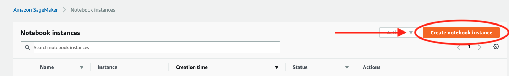

# ML_FraudDetections
Used for the TTB efforts to detect fraudulent labels and formulas

# Instructions to configure LabelValidation.ipynb
***
# When in a local laptop/desktop, need to pip3 install -r requirements.txt

# From the SageMaker HomePage
# Select "Create notebook instance"

# After selecting Create notebook instance go to the Notebook instance settings page.
# Enter "Notebook instance name", and "Notebook instance type"

# From the Notebook instance settings page,
# Select "Enter a custom IAM role ARN"
# Enter an IAM role ARN
# Select "Enable - Give users root access to the notebook"
# Select "No Custom Encryption"

# From the Notebook instance settings page,
# Select "us-east-1a"

# From the Notebook instance settings page,
# Select "sagemakerConnectionSecurityGrp"

# From the Notebook instance settings page,
# Look for the "Pending" button indicating pending creation of Notebook Instance

# From the SageMaker Homepage select "Open Jupyter"

# From the Jupyter Notebook "Upload" LabelValidation.ipynb, FraudLabelConfig.json, and create labelImages.tar from TestData directory

# Select Upload twice to upload properly

# Untar labelImages.tar in a terminal
# Open a terminal

# Go to the terminal, cd to SageMaker, mkdir TestData, and in TestData tar xvf labelImages.tar

# Click to open LabelValidation.ipynb
# When in  Jupyter Notebook, need to use the "conda_tensorflow_p36" kernel 
# If UI asks to select Kernel upon opening notebook, enter X, and cancel

# Make certain that you do not select "conda_amazaonei_tensorflow_p36" kernel

# Make certain that you are using the correct kernel "conda_tensorflow_p36" kernel

# Instructions to configure FormulaFraudDetection.ipynb
***
# When in a local laptop/desktop, need to pip3 install -r requirements.txt

# From the SageMaker Homepage select "Open Jupyter"

# From the Jupyter Notebook "Upload" FormulaFraudDetection.ipynb, and create formula_fraud.tar from TestData directory

# Select Upload twice to upload properly

# Untar formula_fraud.tar in a terminal
# Open a terminal

# Go to the terminal, cd to SageMaker, mkdir TestData, and in TestData tar xvf formula_fraud.tar

# Click to open FormulaFraudDetection.ipynb
# When in  Jupyter Notebook, need to use the conda_python3 kernel 
# If UI asks to select Kernel upon opening notebook, enter X, and cancel

# Make certain that you are using the correct kernel "conda_tensorflow_p36" kernel

